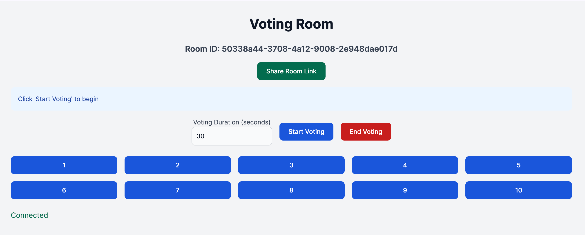

# Simple Vote App

A real-time voting application built with Node.js and WebSockets.

## Screenshots


_Caption: create or enter voting screen_


_Caption: voting screen_

## Features

- Create voting rooms
- Real-time voting with instant results
- Host controls for starting and ending votes
- Responsive design for desktop and mobile devices

## Technologies Used

- Node.js
- Express.js
- WebSocket (ws)
- SQLite3
- UUID

## Getting Started

### Prerequisites

- Node.js (v12 or higher)
- npm (Node Package Manager)

### Installation

1. Clone the repository:

   ```
   git clone https://github.com/yourusername/simple-vote-app.git
   ```

2. Navigate to the project directory:

   ```
   cd simple-vote-app
   ```

3. Install dependencies:

   ```
   npm install
   ```

4. Start the server:

   ```
   node server.js
   ```

5. Open your browser and visit `http://localhost:3000` (or the port you've configured).

## Usage

1. Create a new room by clicking "Create Room" on the homepage.
2. Share the room link with participants.
3. As the host, start the voting when ready.
4. Participants can cast their votes in real-time.
5. View live results as votes are submitted.
6. End the voting session to finalize results.

## Dockerization

This project can be run using Docker. Follow these steps to build and run the Docker container:

### Using Docker

1. Build the Docker image:

   ```bash
   docker build -t simple-vote-app .
   ```

2. Run the Docker container:

   ```bash
   docker run -p 3000:3000 -v $(pwd)/data:/app/data simple-vote-app
   ```

Your application will be accessible at `http://localhost:3000`.

### Using Docker Compose

Alternatively, you can use Docker Compose to run the application:

1. Make sure you have Docker Compose installed.
2. Run the following command in the project root:

   ```bash
   docker-compose up -d
   ```

This will build the image if it doesn't exist and start the container in detached mode.

### SQLite Database Persistence

The SQLite database file is stored in the `/app/data` directory inside the container. This directory is mapped to the `./data` directory in your project root on the host machine. This ensures that your database data persists even when the container is stopped or removed.

### Environment Variables

If your application uses environment variables, create a `.env` file in the project root and add the following line to the `docker-compose.yml` file under the `app` service:

```yaml
env_file:
  - .env
```

Then run the container with:

```bash
docker-compose up -d
```

## Contributing

Contributions are welcome! Please feel free to submit a Pull Request.

## Acknowledgments

- Thanks to all contributors who have helped with this project.
- Inspired by the need for simple, real-time voting solutions.

## Dockerization

This project can be run using Docker. Follow these steps to build and run the Docker container:

1. Build the Docker image:

   ```bash
   docker build -t ai-chat-app .
   ```

2. Run the Docker container:
   ```bash
   docker run -p 3000:3000 ai-chat-app
   ```

Your application will be accessible at `http://localhost:3000`.

### Using Docker Compose

Alternatively, you can use Docker Compose to run the application:

1. Make sure you have Docker Compose installed.
2. Run the following command in the project root:
   ```bash
   docker-compose up
   ```

This will build the image if it doesn't exist and start the container.

### Environment Variables

If your application uses environment variables, create a `.env` file in the project root and run the container with:
